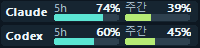

# AI Mon

[English](README.md) · [언어팩 작성 안내](docs/LOCALIZATION.md)

Claude Code와 Codex의 **계정 잔여 한도와 오늘 로컬 토큰 사용량**을 표시하는 Windows 트레이 앱입니다.
C++17과 Win32로 만들며, 압축 전 실행 파일 1,000,000바이트 이하를 배포 조건으로 검사합니다.

**다운로드:** [한국어 설치 파일](https://github.com/han65535/ai-mon/releases/latest/download/AI-Mon-0.3.4-x64-ko.msi) · [영문 설치 파일](https://github.com/han65535/ai-mon/releases/latest/download/AI-Mon-0.3.4-x64-en.msi) · [포터블 EXE](https://github.com/han65535/ai-mon/releases/latest/download/ai-mon.exe) · [전체 릴리스](https://github.com/han65535/ai-mon/releases)

## 스크린샷

**미니 창**



**상세 창 (영문 UI)**

<a href="docs/images/screenshot.png"></a>

## 실행

**설치형:** `out/Installer/AI-Mon-0.3.4-x64-ko.msi`를 더블클릭합니다. 현재 사용자 계정의
`%LOCALAPPDATA%\Programs\AI Mon`에 설치하고 시작 메뉴에 바로가기를 만듭니다.
Windows 설정의 **앱 → 설치된 앱 → AI Mon → 제거**에서 제거할 수 있습니다.
설정과 사용량 캐시는 제거 후에도 보존됩니다. MSI를 다시 열면 복구 또는 제거를 선택할 수 있습니다.

**포터블:** 빌드된 `out/Release/ai-mon.exe`를 바로 실행합니다. 이 EXE 하나만 복사하면 됩니다.

Windows 10/11 x64가 대상이며 별도 .NET, Node.js 또는 C++ 런타임 설치를 요구하지 않습니다.
실제 확인한 환경과 아직 검증하지 못한 항목은 [빌드 및 검증 기록](docs/BUILD_AND_RELEASE.md)을 참고하세요.

- 첫 실행은 사용량 창을 엽니다. 창을 닫으면 트레이에 남습니다.
- Claude·Codex 트레이 아이콘에 잔여율을 표시합니다. 왼쪽 막대는 단기, 오른쪽은 주간이며 클릭하면 상세 그래프와 초기화 시간을 봅니다. 우클릭 메뉴의 **종료**로 앱을 끝냅니다.
- **미니 그래프**는 시계 칸 높이의 작은 2줄 창으로 단기·주간 잔여율을 표시합니다. 창을 드래그해 이동하고 우클릭으로 설정합니다. 설정에서 투명도 슬라이더와 Windows 로그인 시 자동 실행을 선택할 수 있습니다. 제작자는 정보 창에 표시합니다.
- Codex는 로그에서 한도를 읽습니다. Claude는 설치 및 로그인된 Claude Code를 통해 **2분마다 자동 조회**하며 VS Code 확장 사용 시에도 동작합니다. **새로고침**으로 즉시 조회할 수 있습니다(최소 15초 간격). 터미널 상태줄 연결은 선택 기능입니다. [연결 구조](docs/QUOTAS.md).
- **설정**에서 제공자별 수집 여부, 로그 폴더, 갱신 주기, 시작 시 창 표시와 언어를 바꿉니다.
- **언어**에서 자동 감지·한국어·영어를 선택하고 **저장**하면 즉시 적용됩니다.
- `%LOCALAPPDATA%\AI Mon\languages`에 번역 JSON을 추가하고 설정을 다시 열면 추가 언어를 선택할 수 있습니다. 누락된 번역은 영어로 표시합니다.
- **새로고침**은 수집을 즉시 요청합니다. 자동 갱신 기본값은 10초입니다.
- `—`는 현재 보고된 한도가 없거나 초기화 시각이 지나 갱신을 기다린다는 뜻입니다. 0%나 100%로 추정하지 않습니다.
- 단기 한도 길이는 서비스가 보고한 값을 따릅니다. 주간 한도만 제공되는 계정에는 단기 값을 만들어 넣지 않습니다.

잔여율은 서비스가 보고한 값으로 표시하며 토큰 합계에서 추정하지 않습니다. 입력 토큰은 캐시를 포함합니다.
보조 토큰 합계는 이 PC 기록에 한정됩니다. 실제 청구액과 계정 한도의 기기별 사용 내역은 제공하지 않습니다.

## 데이터 위치

기본 탐색 경로:

| 제공자 | 로그 폴더 |
| --- | --- |
| Claude Code | `%USERPROFILE%\.claude\projects` (`CLAUDE_CONFIG_DIR` 설정 시 해당 경로 아래 `projects`) |
| Codex | `%USERPROFILE%\.codex\sessions` (`CODEX_HOME` 설정 시 해당 경로 아래 `sessions`) |

하위 폴더의 `.jsonl` 파일을 읽으며 원본 로그를 수정하거나 대화 내용을 보관하지 않습니다. 앱이 인증 파일을 직접 읽지 않고, 설치된 공식 Claude Code가 기존 로그인과 네트워크를 사용해 한도를 조회합니다. 모델 질문은 보내지 않습니다. 선택 기능인 상태줄 연결 시에는 복원용 백업을 만듭니다.
프롬프트나 응답 본문은 보관하지 않습니다.

설정과 정규화된 사용량 캐시는 `%LOCALAPPDATA%\AI Mon\`에 저장합니다.

- `settings.json`: 수집 폴더와 UI 설정.
- `state.json`: 최근 7일 이벤트, 한도 기록 및 파일 읽기 위치를 함께 저장한 복구 가능한 캐시.
- `claude-quota.json`: 상태줄에서 받은 한도 값.
- `claude-statusline-backup.json`: 연결 해제 시 복원할 기존 상태줄 설정.

손상된 캐시는 남아 있는 원본에서 다시 구성합니다. 이미 삭제된 원본은 복원할 수 없습니다.
폴더를 변경하면 해당 제공자의 기존 집계를 비우고 새 폴더 기준으로 수집합니다.

## 빌드

무료 포터블 **LLVM-MinGW UCRT x64**를 사용합니다. Visual Studio 설치는 필요하지 않습니다.
[공식 릴리스](https://github.com/mstorsjo/llvm-mingw/releases/tag/20260908)의 `llvm-mingw-20260908-ucrt-x86_64.zip`을 내려받아 `.tools/llvm-mingw-20260908-ucrt-x86_64`에 풀거나, `-Toolchain`으로 도구 위치를 지정합니다.
컴파일러는 저장소와 배포 파일에 포함하지 않습니다. 검증한 압축 파일의 해시는 [빌드 문서](docs/BUILD_AND_RELEASE.md)에 있습니다.

```powershell
# 기본 도구 경로 사용
.\scripts\build.ps1

# 다른 위치에 준비한 LLVM-MinGW 사용
.\scripts\build.ps1 -Toolchain 'C:\tools\llvm-mingw'

# 집계·저장·감시 테스트
.\scripts\test.ps1

# 디버깅용 빌드 (1MB 제한 적용 안 함)
.\scripts\build.ps1 -Configuration Debug

# Windows 기본 도구로 MSI 생성 (추가 패키징 도구 설치 불필요)
.\scripts\package.ps1 -Language ko
.\scripts\package.ps1 -Language en # 영문 설치 마법사

# 앱 재빌드 후 MSI 생성
.\scripts\package.ps1 -Rebuild -Language ko
```

PowerShell 빌드 스크립트는 도구를 자동 다운로드하거나 시스템 설정을 변경하지 않습니다.
회사의 스크립트 실행 정책이 적용된다면 승인된 실행 방법을 사용합니다.

## 개발 문서

- [잔여 한도·트레이 그래프·Claude 연결](docs/QUOTAS.md)
- [개발 기획서](docs/DEVELOPMENT_PLAN.md)
- [지원하는 제공자 기록 형식과 집계 규칙](docs/PROVIDER_FORMATS.md)
- [빌드·실행 검증 및 제한 사항](docs/BUILD_AND_RELEASE.md)
- [MSI 설치 패키지와 검증](docs/INSTALLER.md)

JSON 파서는 MIT 라이선스의 [cJSON 1.7.19](https://github.com/DaveGamble/cJSON/tree/v1.7.19)를 사용합니다.
AI Mon 자체도 [MIT 라이선스](LICENSE)로 배포합니다.
라이선스 원문은 소스의 `third_party/cjson/LICENSE` 및 앱 **정보** 창에 포함됩니다.
