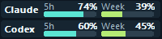
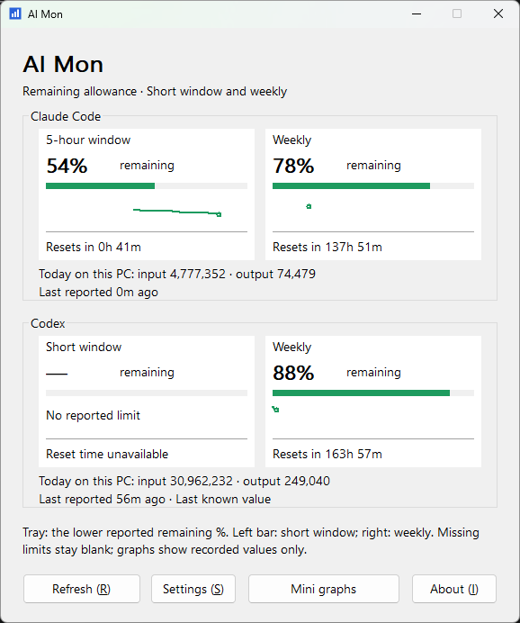

# AI Mon

[한국어](README.ko.md) · [Language packs](docs/LOCALIZATION.md)

A small, native Windows tray app showing **remaining subscription allowance and local token usage** for Claude Code and Codex. Built with C++17 and Win32. Both the executable and installer must stay below **1,000,000 bytes**.

**Download:** [English installer](https://github.com/han65535/ai-mon/releases/latest/download/AI-Mon-0.3.4-x64-en.msi) · [한국어 설치](https://github.com/han65535/ai-mon/releases/latest/download/AI-Mon-0.3.4-x64-ko.msi) · [Portable EXE](https://github.com/han65535/ai-mon/releases/latest/download/ai-mon.exe) · [All releases](https://github.com/han65535/ai-mon/releases)

## Screenshots

**Mini window**



**Main window**

<a href="docs/images/screenshot.png"></a>

## Run

**Installer:** open `out/Installer/AI-Mon-0.3.5-x64-en.msi` (English wizard) or `AI-Mon-0.3.5-x64-ko.msi` (Korean wizard). Choose one; both install the same bilingual app for your user account under `%LOCALAPPDATA%\Programs\AI Mon`, with a Start menu shortcut. Reopen the original MSI to repair/remove, or uninstall through Windows Settings. Settings and usage cache are preserved.

**Portable:** copy and run `out/Release/ai-mon.exe`. That single file includes English and Korean.

Targets Windows 10/11 x64, with no separate .NET, Node.js, or C++ runtime installation. Current validation was performed on Windows 11 build 26200; a clean Windows 10 machine, multiple display scaling settings, and a 24-hour run still need validation.

- Two tray icons show Claude/Codex remaining percentages. The left miniature bar is short-term, the right weekly. Click to open detailed bars, recorded history, and reset countdowns; choose **Exit** from the tray menu to quit.
- **Mini graphs** opens a clock-height, two-row strip with short-term and weekly allowance. Drag anywhere; right-click for settings. Settings includes a transparency slider and optional Windows sign-in startup. The About dialog credits the author.
- In 0.3.5, Codex and Claude allowance are queried through their installed, signed-in CLIs every two minutes, even without a conversation on this PC. Codex uses the main account allowance; Spark/model-specific limits and session telemetry cannot overwrite it. The Codex VS Code extension's native CLI is also supported. **Refresh** requests an earlier check (at least 15 seconds apart). The Claude terminal status-line connection is optional. [Setup and behavior](docs/QUOTAS.md).
- **Settings** controls collection folders, enabled providers, refresh interval, startup window visibility, and **Language**.
- Choose **Automatic**, **English**, or **한국어**, then **Save**. Changes apply immediately. Automatic follows Windows display language, falling back to English.
- Add community JSON packs under `%LOCALAPPDATA%\AI Mon\languages`, then reopen Settings. See [the translation guide](docs/LOCALIZATION.md).
- Refresh defaults to 10 seconds. **Refresh** requests collection immediately.
- `—` means no current reported allowance for that window. Missing limits and expired reset times never turn into an assumed zero or 100%. Old readings are marked as last-known values.

Remaining percentages come from provider reports, not estimates based on token totals. Short-window length follows the reported data (often five hours); a weekly-only account shows no invented short window. Local token totals cover this PC and include cache tokens in input. Billing amounts and per-device breakdowns of account quota are outside this release's scope.

## Local data

| Provider | Default log folder |
| --- | --- |
| Claude Code | `%USERPROFILE%\.claude\projects`, or `projects` under `CLAUDE_CONFIG_DIR` |
| Codex | `%USERPROFILE%\.codex\sessions`, or `sessions` under `CODEX_HOME` |

AI Mon reads `.jsonl` files recursively without changing them or retaining prompt/response bodies. It does not read authentication files itself. Claude's official CLI uses its existing login and network connection to query allowance; no model prompt is sent. The optional status-line connection keeps a restorable backup.

App data lives in `%LOCALAPPDATA%\AI Mon`: `settings.json` stores preferences, and `state.json` stores up to seven days of normalized usage events, allowance history, and file checkpoints. `claude-quota.json` receives normalized CLI/status-line allowance, `mini-window.json` stores mini-window placement, and `claude-statusline-backup.json` preserves an optional status-line connection. A damaged cache can be rebuilt only from source logs that still exist. Changing a provider's folder resets that provider's collected scope.

## Build

Use the free, portable **LLVM-MinGW UCRT x64** toolchain. Visual Studio installation is not required. Download and extract `llvm-mingw-20260908-ucrt-x86_64.zip` from the [official release](https://github.com/mstorsjo/llvm-mingw/releases/tag/20260908) into `.tools/llvm-mingw-20260908-ucrt-x86_64`, or pass your toolchain folder with `-Toolchain`. The compiler is not included in this repository; the verified archive hash is recorded in [build documentation](docs/BUILD_AND_RELEASE.md).

```powershell
.\scripts\build.ps1
.\scripts\build.ps1 -Toolchain 'C:\tools\llvm-mingw'
.\scripts\test.ps1
.\scripts\build.ps1 -Configuration Debug

# Windows makecab.exe + Windows Installer COM; no installer SDK needed
.\scripts\package.ps1 -Language en
.\scripts\package.ps1 -Language ko
# Add -Rebuild to compile the application first

.\scripts\test-languages.ps1
.\scripts\test-quota-bridge.ps1
.\scripts\test-quota-ui.ps1 -Language en
.\scripts\test-installer-ui.ps1 -Language en
.\scripts\test-installer.ps1 -Language en
# Repeat installer checks with -Language ko
```

Scripts do not download tools or change system execution policies. Installer integration tests temporarily register the app, install into a unique workspace folder, repair, and uninstall; they stop if an existing AI Mon installation is found.

Release builds validate embedded translations, executable size, x64 architecture, ASLR/DEP/CFG flags, and Windows system DLL dependencies. Generated size/hash reports live under `out/Release` and `out/Installer`.

## Documentation

- [Remaining allowance, tray graphs, and Claude setup (English)](docs/QUOTAS.md)
- [Languages and community packs (English)](docs/LOCALIZATION.md)
- [Development plan (Korean)](docs/DEVELOPMENT_PLAN.md)
- [Provider formats and aggregation rules (Korean)](docs/PROVIDER_FORMATS.md)
- [Build validation and limitations (Korean)](docs/BUILD_AND_RELEASE.md)
- [Installer behavior and validation (Korean)](docs/INSTALLER.md)

AI Mon is distributed under the [MIT license](LICENSE). The JSON parser is cJSON 1.7.19; its MIT license is included in `third_party/cjson/LICENSE` and in the app's About dialog.
